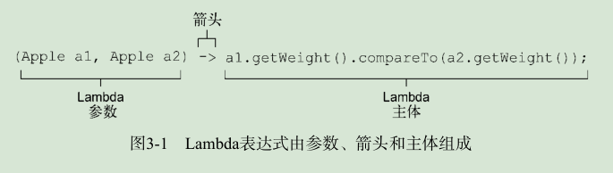
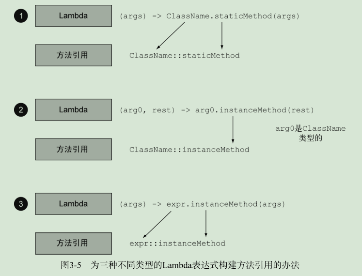

# my-action-java8

此处列出我关于 Java8 的学习实践。

- [Lambda in action](lambda-in-action.md) https://github.com/java8/Java8InAction.git

# HandBook

## JDK8 新增特性
- Lambda 表达式(匿名函数)
- 流处理(stream API) 
- 用行为参数化把代码传递给方法
- 方法引用
- 函数式编程
- 默认方法、新的Optional类、CompleteableFuture
- 新的日期和时间API

#### 1.
Java 8中的主要变化反映了它开始远离常侧重改变现有值的经典面向对象思想，而向函数式编程领域转变，在大面上考虑做什么（例如，创建一个值代表所有从A到B低于给定价格的交通线路）被认为是头等大事，并和如何实现（例如，扫描一个数据结构并修改某些元素）区分开来。

#### 2.
Scala和Groovy等语言的实践已经证明，让方法等概念作为一等值可以扩充程序员的工具库，从而让编程变得更容易。一旦程序员熟悉了这个强大的功能，他们就再也不愿意使用没有这一功能的语言了。因此，Java 8的设计者决定允许方法作为值，让编程更轻松。此外，让方法作为值也构成了其他若干Java 8功能（如 Stream ）的基础。

#### 3.
Collection主要是为了存储和访问数据，而Stream则主要用于描述对数据的计算。这里的关键点在于，Stream允许并提倡并行处理一个 Stream 中的元素。


#### 4.
Java 8中加入默认方法主要是为了支持库设计师，让他们能够写出更容易改进的接口。

#### 5. Lambda


Lambda 表达式三要素：
- 参数列表
- 箭头
- Lambda主体

```
(parameters) -> expression
```
or
```
(parameters) -> { statements; }
```

Q: 在哪里以及如何使用 Lambda

A: 可以在函数式接口上使用Lambda表达式。

#### 6.
- 函数式接口就是只定义一个抽象方法的接口。
- 接口现在还可以拥有 默认方法（即在类没有对方法进行实现时，其主体为方法提供默认实现的方法）。哪怕有很多默认方法，只要接口只定义了一个抽象方法抽象方法，它就仍然是一个函数式接口。

用函数式接口可以干什么呢？Lambda表达式允许你直接以内联的形式为函数式接口的抽象方法提供实现，并把整个表达式作为函数式接口的实例。

#### 7.
```
@FunctionalInterface
```

函数描述符: 函数式接口的抽象方法的签名基本上就是Lambda表达式的签名。我们将这种抽象方法叫作函数描述符。

#### 8. 常用函数式接口

- `java.util.function.Predicate<T>`  定义了一个名叫 test 的抽象方法，它接受泛型 T 对象，并返回一个 boolean 。
- `java.util.function.Consumer<T>` 定义了一个名叫 accept 的抽象方法，它接受泛型 T 的对象，没有返回（ void ）。 
- `java.util.function.Function<T, R>` 定义了一个叫作 apply 的方法，它接受一个泛型 T 的对象，并返回一个泛型 R 的对象。


#### 9.
Lambda可以没有限制地捕获（也就是在其主体中引用）实例变量和静态变量。但局部变量必须显式声明为 final ，或事实上是 final 。

#### 10. 方法引用
方法引用可以被看作仅仅调用特定方法的Lambda的一种快捷写法。它的基本思想是，如果一个Lambda代表的只是“直接调用这个方法”，那最好还是用名称来调用它，而不是去描述如何调用它。事实上，方法引用就是让你根据已有的方法实现来创建Lambda表达式。但是，显式地指明方法的名称，你的代码的可读性会更好。它是如何工作的呢？当你需要使用方法引用时，目标引用放在分隔符 :: 前，方法的名称放在后面。

方法引用的等价表示：
```
(Apple a) -> a.getWeight()                Apple::getWeight
() -> Thread.currentThread().dumpStack()  Thread.currentThread()::dumpStack
(str, i) -> str.substring(i)              String::substring
(String s) -> System.out.println(s)       System.out::println
```


- 构造函数引用 `ClassName::new`

#### 11. 流
流是Java API的新成员，它允许你以声明性方式处理数据集合。请注意，和迭代器类似，流只能遍历一次。你可以从原始数据源那里再获得一个新的流来重新遍历一遍，就像迭代器一样。

流的使用一般包括三件事：
- 一个数据源（如集合）来执行一个查询；
- 一个中间操作链，形成一条流的流水线；
  - filter
  - distinct
  - skip
  - limit
  - map
  - mapToInt
  - flatmap
  - sorted
- 一个终端操作，执行流水线，并能生成结果。
  - anyMatch
  - noneMatch
  - allMatch
  - findAny
  - findFirst
  - forEach
  - collect
  - reduce
  - count
  - sum
  - min
  - max
  
- IntStream
  - range
  - rangeClosed

**构建流**
- 由值创建流 
```
Stream.of("Java 8 ", "Lambdas ", "In ", "Action");
Stream.empty()
````

- 由数组创建流
```
int[] numbers = {2, 3, 5, 7, 11, 13};
int sum = Arrays.stream(numbers).sum();
```

- 由文件生成流
```
long uniqueWords = 0;
try(Stream<String> lines =
    Files.lines(Paths.get("data.txt"), Charset.defaultCharset())){
        uniqueWords = lines.flatMap(line -> Arrays.stream(line.split(" ")))
            .distinct()
            .count();
} catch(IOException e) {

}
```

- 由函数生成流
```
Stream.iterate(0, n -> n + 2)
    .limit(10)
    .forEach(System.out::println);
```

#### 12. 收集器
预定义收集器的功能，也就是那些可以从 Collectors
类提供的工厂方法（例如 groupingBy ）创建的收集器。它们主要提供了三大功能：
- 将流元素归约和汇总为一个值
- 元素分组
- 元素分区

**归约汇总**
```
Map<Currency, List<Transaction>> transactionsByCurrencies =
transactions.stream().collect(groupingBy(Transaction::getCurrency));

List<Transaction> transactions =
transactionStream.collect(Collectors.toList());

long howManyDishes = menu.stream().collect(Collectors.counting());
long howManyDishes = menu.stream().count();

Optional<Dish> mostCalorieDish =
    menu.stream()
        .collect(maxBy(dishCaloriesComparator));
        
int totalCalories = menu.stream().collect(summingInt(Dish::getCalories));
double avgCalories =menu.stream().collect(averagingInt(Dish::getCalories));
IntSummaryStatistics menuStatistics = menu.stream().collect(summarizingInt(Dish::getCalories));

String shortMenu = menu.stream().map(Dish::getName).collect(joining());
String shortMenu = menu.stream().collect(joining());

int totalCalories = menu.stream().collect(reducing(
        0, Dish::getCalories, (i, j) -> i + j));
int totalCalories = menu.stream().collect(reducing(0,
        Dish::getCalories,
        Integer::sum));
int totalCalories = menu.stream().
    map(Dish::getCalories).reduce(Integer::sum).get();
int totalCalories = menu.stream().mapToInt(Dish::getCalories).sum(); 
```

**分组**
```
Map<Dish.Type, List<Dish>> dishesByType =
    menu.stream().collect(groupingBy(Dish::getType));
    
Map<CaloricLevel, List<Dish>> dishesByCaloricLevel = menu.stream().collect(
    groupingBy(dish -> {
        if (dish.getCalories() <= 400) return CaloricLevel.DIET;
        else if (dish.getCalories() <= 700) return CaloricLevel.NORMAL;
        else return CaloricLevel.FAT;
    })
);
```

**多级分组**
```
Map<Dish.Type, Map<CaloricLevel, List<Dish>>> dishesByTypeCaloricLevel =
    menu.stream().collect(
        groupingBy(Dish::getType,
            groupingBy(dish -> {
                if (dish.getCalories() <= 400) return CaloricLevel.DIET;
                else if (dish.getCalories() <= 700) return CaloricLevel.NORMAL;
                else return CaloricLevel.FAT;
            } )
        )
    );
```

**把收集器的结果转换为另一种类型**
```
Map<Dish.Type, Dish> mostCaloricByType =
    menu.stream()
    .collect(groupingBy(Dish::getType,
        collectingAndThen(
            maxBy(comparingInt(Dish::getCalories)),
            Optional::get)));
            
Map<Dish.Type, Integer> totalCaloriesByType =
    menu.stream().collect(groupingBy(Dish::getType,
        summingInt(Dish::getCalories)));
        
Map<Dish.Type, Set<CaloricLevel>> caloricLevelsByType =
    menu.stream().collect(
        groupingBy(Dish::getType, mapping(
            dish -> { if (dish.getCalories() <= 400) return CaloricLevel.DIET;
            else if (dish.getCalories() <= 700) return CaloricLevel.NORMAL;
            else return CaloricLevel.FAT; },
            toSet() 
        )));
            
Map<Dish.Type, Set<CaloricLevel>> caloricLevelsByType =
    menu.stream().collect(
        groupingBy(Dish::getType, mapping(
            dish -> { if (dish.getCalories() <= 400) return CaloricLevel.DIET;
            else if (dish.getCalories() <= 700) return CaloricLevel.NORMAL;
            else return CaloricLevel.FAT; },
            toCollection(HashSet::new) 
        )));
```

**分区**
```
Map<Boolean, List<Dish>> partitionedMenu =
    menu.stream().collect(partitioningBy(Dish::isVegetarian));
    
```

Collectors类的静态工厂方法：
- toList
- toSet
- toCollection
- counting
- summingInt
- averagingInt
- sumarizingInt
- joining
- maxBy
- minBy
- reducing
- collectingAndThen
- groupingBy
- partitioningBy


#### 13.
- parallel()   并行流
- sequential()  顺序流

#### .
Optional<T> 类（ java.util.Optional ）是一个容器类，代表一个值存在或不存在。
- isPresent()
- ifPresent(Consumer<T> block)
- T get()
- T orElse(T other)


  
  


